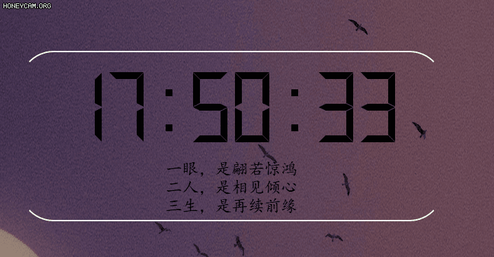
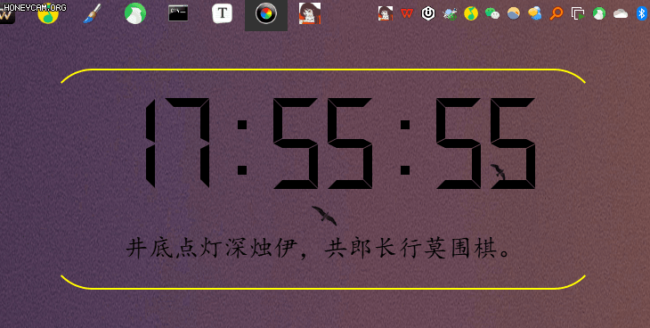
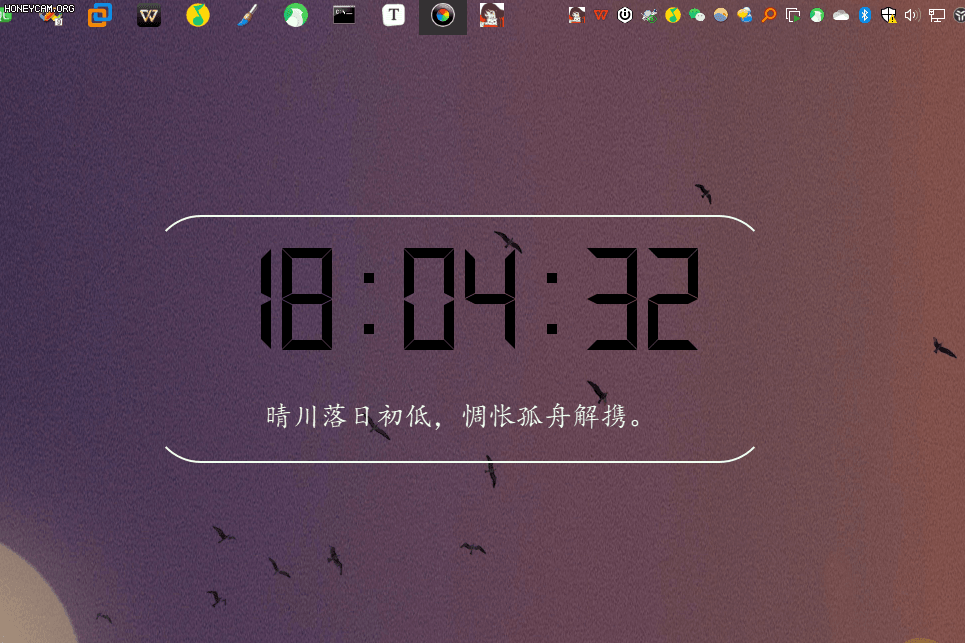

# OneForYou

> 想法来自知乎、各公众号、句读等与文案相关的场景。借以整理
>
> [点这里㊙](https://www.yuque.com/docs/share/78da571b-0bd6-428e-93db-b5673b487d30?#%20%E3%80%8AOneForYou%E3%80%8B)

## ✉️文案

### 文案类型

| **文本类型** | **彩虹屁**🌈 | **情绪**😄 | **鸡汤**🐤 | **情话**💌 | **文案**📑 |
| ------------ | ----------- | --------- | --------- | --------- | --------- |
|              |             |           |           |           |           |

| **文本来源** | **知乎** | **句读** | **小红书** | **每日诗词** | 每日一言 | **自定义** |
| ------------ | -------- | -------- | ---------- | ------------ | -------- | ---------- |
|              |          |          |            |              |          |            |

## 📊程序数据来源

> 目前是从CSV文件读取内容展示在界面

- [x] CSV数据

- [x] API

最终是保存到SQLite中

- [ ] SQLite

## 💄界面

## 四、🚀功能 

## 1. ⏬双击切换

在界面双击即可切换文案

## 2. 🍼更换源

## 3. 🌈更换颜色

1. 更换文案颜色

1. 更换时钟颜色

## 4. 🕓更换切换时间

## 5. 😉隐藏界面 

点击界面，按`ESC`即可隐藏。

